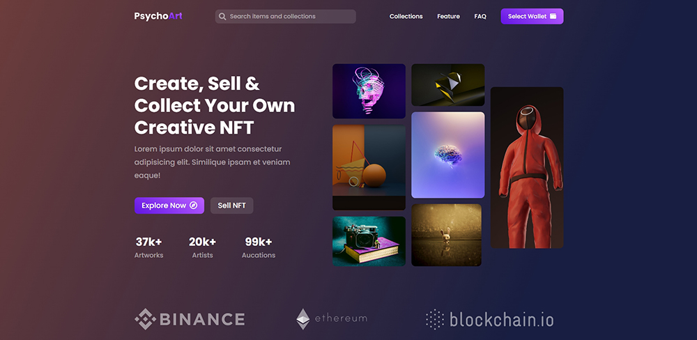

<!-- --------STATS-------- -->

<!-- --------LOGO-------- -->
 

	
	
<strong>PsychoArt - Creative NFTs</strong>

<!-- --------TABLE OF CONTENTS-------- -->

  
Table of Contents

  <ol>
    <li>
      <a href="#about-the-project">About The Project</a>
    </li>
    <li><a href="#contributing">Contributing</a></li>
    <li><a href="#license">License</a></li>
    <li><a href="#contact">Contact</a></li>
  </ol>

<!-- --------ABOUT THE PROJECT-------- -->

## About The Project

	

<strong>PsychoArt</strong> - creative NFTs built via:

<ul>
	<li>HTML</li>
	<li>CSS</li>
	<li>BEM</li>
	<li>SCSS</li>
	<li>JavaScript</li>
	<li>Font Awesome Icons</li>
	<li>SVG Icons</li>
	<li>npm</li>
	<li>normalize.css</li>
	<li>AOS Library</li>
	<li>ESLint (Airbnb)</li>
	<li>Babel</li>
	<li>Webpack</li>
</ul>

<!-- --------CONTRIBUTING-------- -->

## Contributing

Contributions are what make the open source community such an amazing place to learn, inspire, and create. Any contributions you make are **greatly appreciated**.

If you have a suggestion that would make this better, please fork the repo and create a pull request. You can also simply open an issue with the tag "enhancement".
Don't forget to give the project a star! Thanks again!

1. Fork the Project
2. Create your Feature Branch (`git checkout -b feature/AmazingFeature`)
3. Commit your Changes (`git commit -m 'Add some AmazingFeature'`)
4. Push to the Branch (`git push origin feature/AmazingFeature`)
5. Open a Pull Request

<!-- --------LICENSE-------- -->

## License

Distributed under the MIT License. See `LICENSE` for more information.

<!-- --------CONTACT-------- -->

## Contact

Danil Ochagov - danilochagov@gmail.com

Project Link: [https://github.com/ochagovdanil/PsychoArt](https://github.com/ochagovdanil/PsychoArt)
